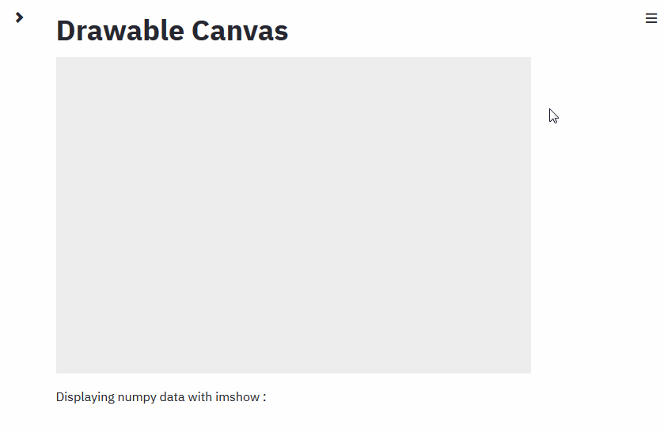

# Streamlit - Drawable Canvas

Streamlit component which provides a sketching canvas using [Fabric.js](http://fabricjs.com/).

[](https://share.streamlit.io/andfanilo/streamlit-drawable-canvas-demo/master/app.py)

[](https://pypi.org/project/streamlit-drawable-canvas/)
[](https://pypi.org/project/streamlit-drawable-canvas/)

<a href="https://www.buymeacoffee.com/andfanilo" target="_blank"></a>



## Features

- Draw freely, lines, circles, boxes and polygons on the canvas, with options on stroke & fill
- Rotate, skew, scale, move any object of the canvas on demand
- Select a background color or image to draw on
- Get image data and every drawn object properties back to Streamlit !
- Choose to fetch back data in realtime or on demand with a button
- Undo, Redo or Delete canvas contents
- Save canvas data as JSON to reuse for another session

## Installation

```shell script
pip install streamlit-drawable-canvas
```

## Example Usage

Copy this code snippet:

```python
import pandas as pd
from PIL import Image
import streamlit as st
from streamlit_drawable_canvas import st_canvas

# Specify canvas parameters in application
drawing_mode = st.sidebar.selectbox(
    "Drawing tool:", ("point", "freedraw", "line", "rect", "circle", "transform")
)

stroke_width = st.sidebar.slider("Stroke width: ", 1, 25, 3)
if drawing_mode == 'point':
    point_display_radius = st.sidebar.slider("Point display radius: ", 1, 25, 3)
stroke_color = st.sidebar.color_picker("Stroke color hex: ")
bg_color = st.sidebar.color_picker("Background color hex: ", "#eee")
bg_image = st.sidebar.file_uploader("Background image:", type=["png", "jpg"])

realtime_update = st.sidebar.checkbox("Update in realtime", True)

    

# Create a canvas component
canvas_result = st_canvas(
    fill_color="rgba(255, 165, 0, 0.3)",  # Fixed fill color with some opacity
    stroke_width=stroke_width,
    stroke_color=stroke_color,
    background_color=bg_color,
    background_image=Image.open(bg_image) if bg_image else None,
    update_streamlit=realtime_update,
    height=150,
    drawing_mode=drawing_mode,
    point_display_radius=point_display_radius if drawing_mode == 'point' else 0,
    key="canvas",
)

# Do something interesting with the image data and paths
if canvas_result.image_data is not None:
    st.image(canvas_result.image_data)
if canvas_result.json_data is not None:
    objects = pd.json_normalize(canvas_result.json_data["objects"]) # need to convert obj to str because PyArrow
    for col in objects.select_dtypes(include=['object']).columns:
        objects[col] = objects[col].astype("str")
    st.dataframe(objects)
```

You will find more detailed examples [on the demo app](https://github.com/andfanilo/streamlit-drawable-canvas-demo/).

## API

```
st_canvas(
    fill_color: str
    stroke_width: int
    stroke_color: str
    background_color: str
    background_image: Image
    update_streamlit: bool
    height: int
    width: int
    drawing_mode: str
    initial_drawing: dict
    display_toolbar: bool
    point_display_radius: int
    key: str
)
```

- **fill_color** : Color of fill for Rect in CSS color property. Defaults to "#eee".
- **stroke_width** : Width of drawing brush in CSS color property. Defaults to 20.
- **stroke_color** : Color of drawing brush in hex. Defaults to "black".
- **background_color** : Color of canvas background in CSS color property. Defaults to "" which is transparent. Overriden by background_image. Changing background_color will reset the drawing.
- **background_image** : Pillow Image to display behind canvas. Automatically resized to canvas dimensions. Being behind the canvas, it is not sent back to Streamlit on mouse event. Overrides background_color. Changes to this will reset canvas contents.
- **update_streamlit** : Whenever True, send canvas data to Streamlit when object/selection is updated or mouse up.
- **height** : Height of canvas in pixels. Defaults to 400.
- **width** : Width of canvas in pixels. Defaults to 600.
- **drawing_mode** : Enable free drawing when "freedraw", object manipulation when "transform", otherwise create new objects with "line", "rect", "circle" and "polygon". Defaults to "freedraw".
  - On "polygon" mode, double-clicking will remove the latest point and right-clicking will close the polygon.
- **initial_drawing** : Initialize canvas with drawings from here. Should be the `json_data` output from other canvas. Beware: if you try to import a drawing from a bigger/smaller canvas, no rescaling is done in the canvas and the import could fail.
- **point_display_radius** : To make points visible on the canvas, they are drawn as circles. This parameter modifies the radius of the displayed circle.
- **display_toolbar** : If `False`, don't display the undo/redo/delete toolbar.

Example:

```python
import streamlit as st
from streamlit_drawable_canvas import st_canvas

canvas_result = st_canvas()
st_canvas(initial_drawing=canvas_result.json_data)
```

- **display_toolbar** : Display the undo/redo/reset toolbar.
- **key** : An optional string to use as the unique key for the widget. Assign a key so the component is not remount every time the script is rerun.

## Development

### Install

- JS side

```shell script
cd frontend
npm install
```

- Python side

```shell script
conda create -n streamlit-drawable-canvas python=3.7
conda activate streamlit-drawable-canvas
pip install -e .
```

### Run

Both webpack dev server and Streamlit should run at the same time.

- JS side

```shell script
cd frontend
npm run start
```

- Python side

```shell script
streamlit run app.py
```

### Cypress integration tests

- Install Cypress: `cd e2e; npm i` or `npx install cypress` (with `--force` if cache problem)
- Start Streamlit frontend server: `cd streamlit_drawable_canvas/frontend; npm run start`
- Start Streamlit test script: `streamlit run e2e/app_to_test.py`
- Start Cypress app: `cd e2e; npm run cypress:open`

## References

- [react-sketch](https://github.com/tbolis/react-sketch)
- [React hooks - fabric](https://github.com/fabricjs/fabric.js/issues/5951#issuecomment-563427231)
- [Simulate Retina display](https://stackoverflow.com/questions/12243549/how-to-test-a-webpage-meant-for-retina-display)
- [High DPI Canvas](https://www.html5rocks.com/en/tutorials/canvas/hidpi/)
- [Drawing with FabricJS and TypeScript Part 2: Straight Lines](https://exceptionnotfound.net/drawing-with-fabricjs-and-typescript-part-2-straight-lines/)
- [Drawing with FabricJS and TypeScript Part 7: Undo/Redo](https://exceptionnotfound.net/drawing-with-fabricjs-and-typescript-part-7-undo-redo/)
- [Types for classes as values in TypeScript](https://2ality.com/2020/04/classes-as-values-typescript.html)
- [Working with iframes in Cypress](https://www.cypress.io/blog/2020/02/12/working-with-iframes-in-cypress/)
- [How to use useReducer in React Hooks for performance optimization](https://medium.com/crowdbotics/how-to-use-usereducer-in-react-hooks-for-performance-optimization-ecafca9e7bf5)
- [Understanding React Default Props](https://blog.bitsrc.io/understanding-react-default-props-5c50401ed37d)
- [How to avoid passing callbacks down?](https://reactjs.org/docs/hooks-faq.html#how-to-avoid-passing-callbacks-down)
- [Examples of the useReducer Hook](https://daveceddia.com/usereducer-hook-examples/) The `useRef` hook allows you to create a persistent ref to a DOM node, or really to any value. React will persist this value between re-renders (between calls to your component function).
- [CSS filter generator to convert from black to target hex color](https://codepen.io/sosuke/pen/Pjoqqp)
- [When does React re-render components?](https://felixgerschau.com/react-rerender-components/#when-does-react-re-render)
- [Immutable Update Patterns](https://redux.js.org/recipes/structuring-reducers/immutable-update-patterns)
- Icons by [Freepik](https://www.flaticon.com/authors/freepik), [Google](https://www.flaticon.com/authors/google), [Mavadee](https://www.flaticon.com/authors/mavadee).
