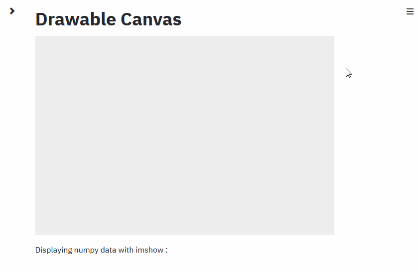

# Streamlit - Drawable Canvas

---

This project is [best effort](https://www.youtube.com/watch?v=1RFJF_ETpLk). Every now and then I'll add something I need myself and let a coding agent do most of the typing, but I don't have the time to go through bigger issues or pull requests. If there's a larger feature you want, fork away!

Please add a thumbs up [HERE](https://github.com/streamlit/streamlit/issues/875) if you wish to see a native implementation maintained by the Streamlit team.

---

Streamlit component which provides a sketching canvas using [Fabric.js](http://fabricjs.com/).

[](https://share.streamlit.io/andfanilo/streamlit-drawable-canvas-demo/master/app.py)

[](https://pypi.org/project/streamlit-drawable-canvas/)
[](https://pypi.org/project/streamlit-drawable-canvas/)

<a href="https://www.buymeacoffee.com/andfanilo" target="_blank"></a>



## Features

- Draw freely, lines, circles, boxes and polygons on the canvas, with options on stroke & fill
- Rotate, skew, scale, move any object of the canvas on demand
- Select a background color or image to draw on
- Get image data and every drawn object properties back to Streamlit !
- Choose to fetch back data in realtime or on demand with a button
- Undo, Redo or Delete canvas contents
- Save canvas data as JSON to reuse for another session

## Installation

Requires **Streamlit >= 1.53** and **Python >= 3.10** (0.10.0 is built on Streamlit
Components v2; see [Upgrading from 0.9.x](#upgrading-from-09x) if you're on an older
Streamlit).

```shell script
pip install streamlit-drawable-canvas
```

`return_image_data=True` additionally requires Pillow and numpy:

```shell
pip install streamlit-drawable-canvas[image]
```

## Example Usage

Copy this code snippet:

```python
import pandas as pd
from PIL import Image
import streamlit as st
from streamlit_drawable_canvas import st_canvas

# Specify canvas parameters in application
drawing_mode = st.sidebar.selectbox(
    "Drawing tool:", ("point", "freedraw", "line", "rect", "circle", "transform")
)

stroke_width = st.sidebar.slider("Stroke width: ", 1, 25, 3)
if drawing_mode == "point":
    point_display_radius = st.sidebar.slider("Point display radius: ", 1, 25, 3)
stroke_color = st.sidebar.color_picker("Stroke color hex: ")
bg_color = st.sidebar.color_picker("Background color hex: ", "#eee")
bg_image = st.sidebar.file_uploader("Background image:", type=["png", "jpg"])

realtime_update = st.sidebar.checkbox("Update in realtime", True)


# Create a canvas component
canvas_result = st_canvas(
    fill_color="rgba(255, 165, 0, 0.3)",  # Fixed fill color with some opacity
    stroke_width=stroke_width,
    stroke_color=stroke_color,
    background_color=bg_color,
    background_image=Image.open(bg_image) if bg_image else None,
    update_streamlit=realtime_update,
    height=150,
    drawing_mode=drawing_mode,
    point_display_radius=point_display_radius if drawing_mode == "point" else 0,
    return_image_data=True,
    key="canvas",
)

# Do something interesting with the image data and paths
if canvas_result.image_data is not None:
    st.image(canvas_result.image_data)
if canvas_result.json_data is not None:
    objects = pd.json_normalize(
        canvas_result.json_data["objects"]
    )  # need to convert obj to str because PyArrow
    for col in objects.select_dtypes(include=["object"]).columns:
        objects[col] = objects[col].astype("str")
    st.dataframe(objects)
```

You will find more detailed examples [on the demo app](https://github.com/andfanilo/streamlit-drawable-canvas-demo/).

For reading the returned drawing -- what's in `json_data`, why a resized shape keeps its
original `width`, how to map canvas coordinates back to your source image -- see
[FAQ.md](./FAQ.md).

## API

```
st_canvas(
    fill_color: str
    stroke_width: int
    stroke_color: str
    background_color: str
    background_image: str | Path | bytes | Image
    update_streamlit: bool
    height: int
    width: int
    drawing_mode: str
    initial_drawing: dict
    display_toolbar: bool
    point_display_radius: int
    return_image_data: bool
    key: str
    on_change: callable
    disabled: bool
    background_image_fit: str
)
```

- **fill_color** : Color of fill for Rect in CSS color property. Defaults to "#eee".
- **stroke_width** : Width of drawing brush in CSS color property. Defaults to 20.
- **stroke_color** : Color of drawing brush in hex. Defaults to "black".
- **background_color** : Color of canvas background in CSS color property. Defaults to "" which is transparent. Overriden by background_image. Changing background_color will reset the drawing.
- **background_image** : Image to display behind canvas: an http(s) URL, a `data:` URI, a local file path, raw image bytes, or a Pillow Image. Automatically resized to canvas dimensions. Being behind the canvas, it is not sent back to Streamlit on mouse event. Overrides background_color. Changes to this will reset canvas contents.
- **update_streamlit** : Whenever True, send canvas data to Streamlit when object/selection is updated or mouse up. Forced off for `drawing_mode="polygon"` -- an in-progress multi-click polygon isn't a meaningful intermediate value; the completed polygon still sends once closed with a right-click.- **height** : Height of canvas in pixels. Defaults to 400.
- **width** : Width of canvas in pixels. Defaults to 600.
- **drawing_mode** : One of `"freedraw"`, `"transform"`, `"line"`, `"rect"`, `"circle"`, `"point"`, `"polygon"`. Enable free drawing when "freedraw", object manipulation when "transform", otherwise create new objects with the rest. Defaults to "freedraw". Any other value raises `ValueError`.
  - On "polygon" mode, double-clicking will remove the latest point and right-clicking will close the polygon.
- **initial_drawing** : Initialize canvas with drawings from here. Should be the `json_data` output from another canvas. Beware: if you try to import a drawing from a bigger/smaller canvas, no rescaling is done in the canvas and the import could fail.
- **point_display_radius** : To make points visible on the canvas, they are drawn as circles. This parameter modifies the radius of the displayed circle.
- **display_toolbar** : If `False`, don't display the undo/redo/reset toolbar. When shown, it appears on hover as a floating card above the canvas's top-right corner, matching Streamlit's own element toolbars, and takes up no layout space.
- **return_image_data** : If `True`, populate `image_data` on the result with the canvas's RGBA pixels. `False` by default -- it PNG-encodes the whole canvas on every send. Requires the `image` extra; accessing `image_data` without both raises.
- **key** : An optional string to use as the unique key for the widget. Assign a key so the component is not remounted on every rerun.
- **on_change** : Optional callback invoked when the component sends a new drawing.
- **background_image_fit** : One of `"stretch"` (default) or `"contain"`. `"stretch"` scales each axis independently to fill the canvas exactly, distorting the image when the aspect ratios differ -- this is the historical behaviour. `"contain"` preserves the aspect ratio, fitting the image inside the canvas and centring it, so a canvas larger than its background image gets margins instead of a stretched image. Ignored when no `background_image` is set. Any other value raises `ValueError`.
- **disabled** : If `True`, render the canvas read-only -- drawing, selection and transforms are all inert, nothing is sent back to Streamlit, and the toolbar is hidden regardless of `display_toolbar`. `initial_drawing` still renders, so this is how you show a drawing back to someone without letting them change it. Defaults to `False`.

Example:

```python
import streamlit as st
from streamlit_drawable_canvas import st_canvas

canvas_result = st_canvas()
st_canvas(initial_drawing=canvas_result.json_data)
```

## Upgrading from 0.9.x

0.10.0 is a breaking release (Streamlit Components v2, Fabric.js 7). If you're
upgrading:

- **`image_data` raises `RuntimeError`** -- it's now opt-in. Pass `return_image_data=True`
  to `st_canvas()`, and install the extra: `pip install streamlit-drawable-canvas[image]`.
- **Old Streamlit or Python** -- 0.10.0 needs Streamlit >= 1.53 and Python >= 3.10. If
  you can't upgrade, pin `streamlit-drawable-canvas==0.9.3`.
- **Saved drawings from 0.9.x with Circle or Point objects render as a thin sliver, not
  the original shape**, when fed back in via `initial_drawing`. Fabric 4 wrote
  `Circle.startAngle`/`endAngle` in radians; Fabric 7 reinterprets those same JSON keys
  as degrees, and `loadFromJSON` doesn't consult the JSON's `version` field to tell the
  difference. This is declared breaking, with no migration shim. Line, Rect, freedraw,
  Polygon, and Transform objects are unaffected -- only objects from `circle`/`point`
  drawing modes carry `startAngle`/`endAngle`.

## Development

Tasks are automated with [just](https://github.com/casey/just) (see `justfile`) and [uv](https://docs.astral.sh/uv/). Run `just` (or `just --list`) to see every recipe.

### Install

```shell script
just setup        # uv sync + npm ci (frontend) + pre-commit install
just reinstall    # same, but wipes .venv / node_modules / build outputs first
```

### Run the demo app

```shell script
just demo   # uv run streamlit run demo_app.py
```

For frontend changes, run the Vite watch-rebuild alongside it in another terminal --
it rebuilds `frontend/build` on every save, which `just demo`'s Streamlit process picks
up on the next rerun:

```shell script
just dev
```

### Lint, format, test

```shell script
just lint    # ruff check + tsc --noEmit + prettier check
just format  # ruff format + prettier write
just test    # pytest + Vitest
```

### End-to-end tests (Playwright)

```shell script
just e2e-setup   # one-time: install deps + browsers
just build       # E2E needs the built frontend
just e2e         # uv run pytest e2e_playwright -n auto
```

See the [`justfile`](./justfile) (`just --list`) for the full recipe reference, including
version bumps and publishing.

## References

- [Fabric.js](http://fabricjs.com/)
- [Streamlit Components v2](https://docs.streamlit.io/develop/concepts/custom-components)
